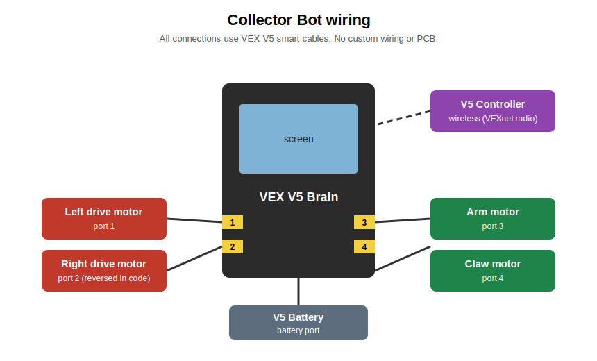
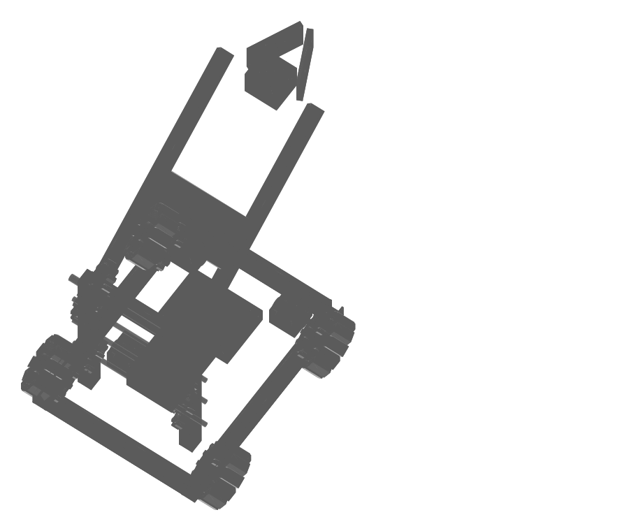

# Collector Bot

A VEX V5 robot that drives around, lifts its arm, and picks stuff up with a
claw. I built it from VEX metal parts, four motors, and a V5 brain, and wrote
the code in C++ with [PROS](https://pros.cs.purdue.edu/).

## About this project

Collector Bot is my individual project. I've been working on it since April
2026, I made it for Stardance Hack Club, and I'm planning to use it in the
2026 to 2027 TSA (Technology Student Association) year.

I made it because I wanted a robot that could actually collect and carry
things, not just drive around. Also, building one thing where the mechanics,
the electronics, and the code all have to work together teaches you way more
than doing any of those on their own.

## What it does

You drive it with the V5 controller. You lower the arm over an object, close
the claw to grab it, lift it up, and carry it wherever you want. It also has a
small autonomous routine where it drives forward on its own for one second,
which is for the autonomous part of a match.

## The robot

* **Drivetrain:** two drive motors (one per side) with tank style controls
* **Arm:** a motor powered lift made of two long metal beams with gears
* **Claw:** a motor that opens and closes to grab and let go of objects
* **Brain:** VEX V5 brain running the PROS kernel

The arm and claw motors use HOLD brake mode, so when you let go of the buttons
the arm stays up and the claw keeps its grip instead of dropping everything.

## Controls

| Control | What it does |
|---|---|
| Left joystick (up/down) | Left wheels forward/backward |
| Right joystick (up/down) | Right wheels forward/backward |
| R1 | Lift the arm up |
| R2 | Lower the arm down |
| L1 | Close the claw (grab) |
| L2 | Open the claw (let go) |

## Motor ports

| Port | Motor |
|---|---|
| 1 | Left drive |
| 2 | Right drive (reversed) |
| 3 | Arm |
| 4 | Claw |

## Wiring

Everything connects with VEX V5 smart cables from the brain to the motors.
There's no PCB or custom wiring in this project.

## How to run it from a laptop

1. Install [VS Code](https://code.visualstudio.com/) and the
   [PROS extension](https://marketplace.visualstudio.com/items?itemName=sigbots.pros)
   from the VS Code marketplace.
2. Download this repository (green **Code** button, then **Download ZIP**, then
   unzip it) and open the folder in VS Code.
3. Click the PROS icon in the left sidebar and hit **Build**. It should finish
   with no errors.
4. Plug the V5 brain into the laptop with a USB cable and turn the brain on.
5. Hit **Upload** in the PROS sidebar to send the program to the brain.
6. On the brain's touchscreen, open **Programs** and run the program.
7. Turn on the V5 controller (it has to be paired with the brain) and drive.

## Code

All the robot code is in [`src/main.cpp`](src/main.cpp):

* `initialize()` runs once at startup and sets up the screen and brake modes
* `autonomous()` drives forward for one second on its own
* `opcontrol()` is the main driving loop that reads the controller 50 times a
  second and moves the wheels, arm, and claw

## Devlog

The whole build journal, from the first parts to the finished code, is in
[JOURNAL.md](JOURNAL.md).

## Pictures of Bot

## 3D model

There's a simplified 3D model of the robot in
[cad/collector_bot.stl](cad/collector_bot.stl), which GitHub can open in a 3D
viewer. Quick note on this: I designed and built the robot physically, not in
CAD, so this model is a recreation I made after the build. It's generated by a
Python script, [cad/generate_model.py](cad/generate_model.py), that builds the
drive base, omni wheels, brain, towers, geared arm, and claw out of simple
shapes using the robot's real approximate measurements. The image above is
rendered straight from the STL by
[cad/render_model.py](cad/render_model.py).

The same model is also saved as a STEP file,
[cad/collector_bot.step](cad/collector_bot.step), made by
[cad/generate_step.py](cad/generate_step.py) with cadquery. The STEP one has
each part colored like the real robot (silver metal, red and green gears,
black motors) and opens in any CAD program like Onshape, Fusion, or FreeCAD.

## Bill of materials

This same list with the same links is also in [bom.csv](bom.csv) in the root
of the repository.

| Part | Quantity | Link |
|---|---|---|
| VEX V5 Brain | 1 | [vexrobotics.com](https://www.vexrobotics.com/276-4810.html) |
| VEX V5 Controller | 1 | [vexrobotics.com](https://www.vexrobotics.com/276-4820.html) |
| VEX V5 Battery | 1 | [vexrobotics.com](https://www.vexrobotics.com/276-4811.html) |
| V5 Smart Motors | 4 (2 drive, 1 arm, 1 claw) | [vexrobotics.com](https://www.vexrobotics.com/276-4840.html) |
| Omni wheels | 4 | [vexrobotics.com](https://www.vexrobotics.com/omni-wheels.html) |
| High strength gears (red and green) | assorted | [vexrobotics.com](https://www.vexrobotics.com/gears.html) |
| Metal C channels, plates, axles, and standoffs | assorted | [vexrobotics.com](https://www.vexrobotics.com/structure.html) |
| Screws, nuts, spacers, and shaft collars | assorted | [vexrobotics.com](https://www.vexrobotics.com/hardware.html) |
| V5 Smart Cables | 4 | [vexrobotics.com](https://www.vexrobotics.com/catalogsearch/result/?q=v5+smart+cable) |

## License

This project is open source under the MIT License. See [LICENSE](LICENSE).
